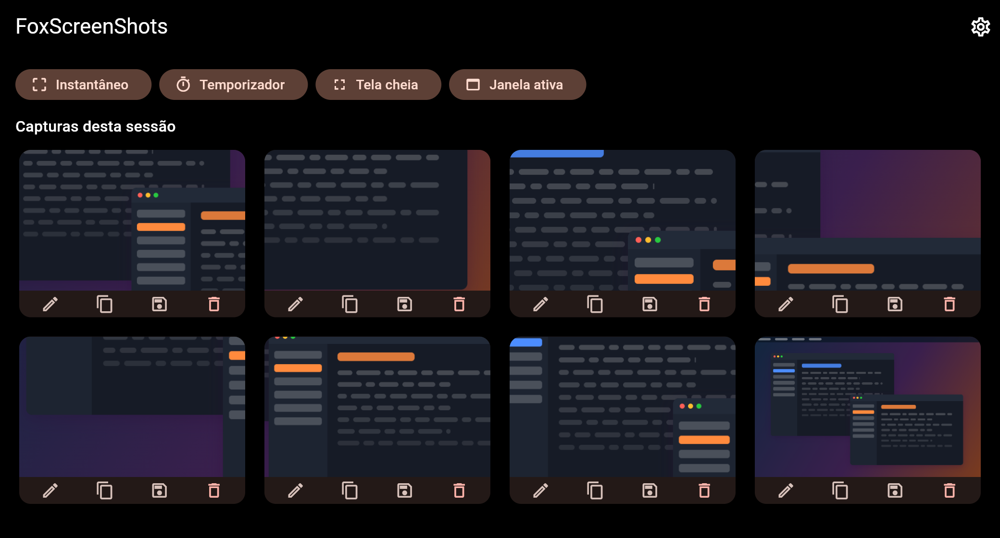
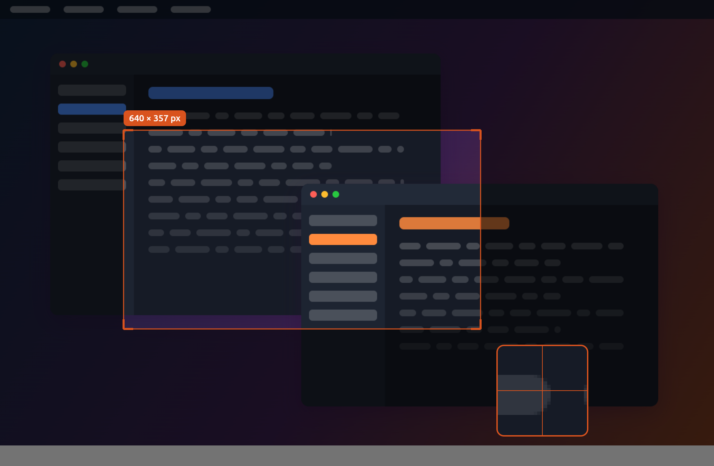
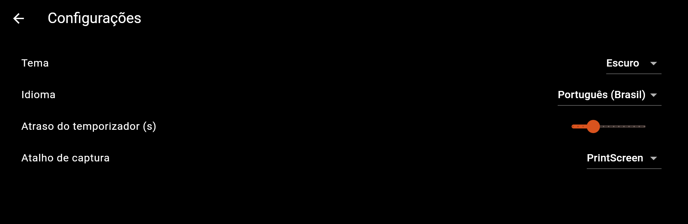
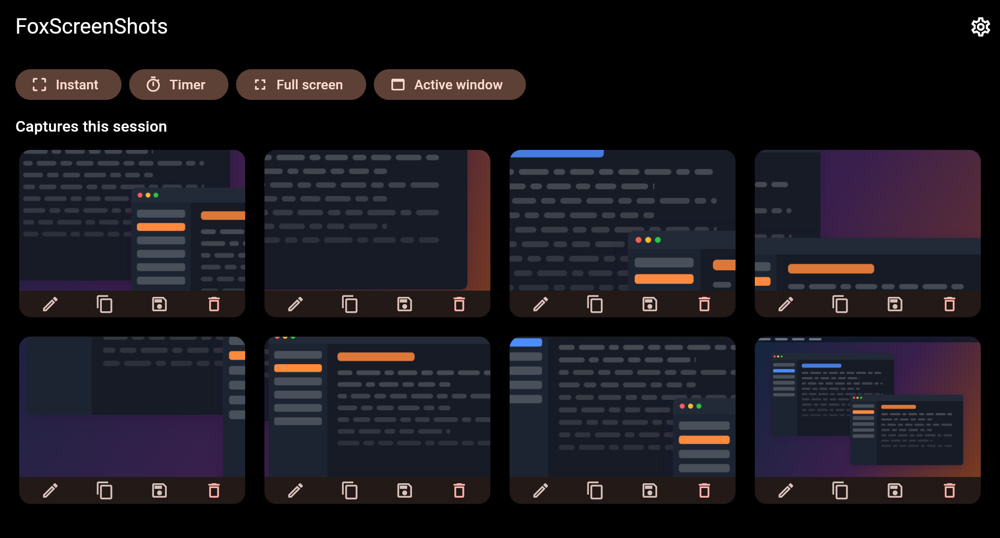
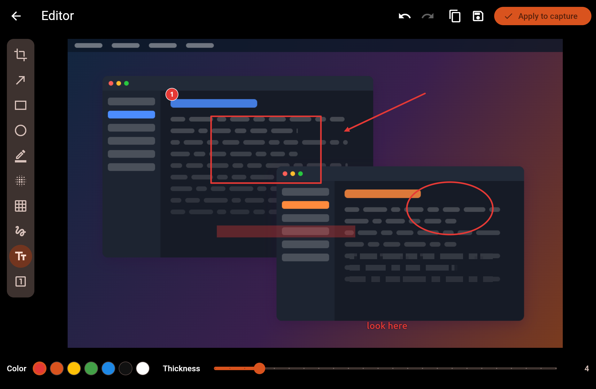
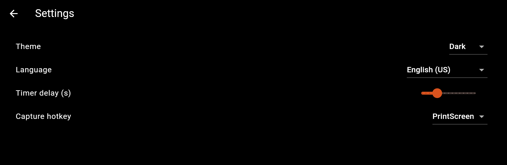

<div align="center">

# 🦊 FoxScreenShots

**Captura e edição rápida de screenshots — Windows · Linux · macOS**

[](https://github.com/romulofer/FoxScreenshots/actions/workflows/ci.yml)
[](LICENSE)

Feito em Flutter. Código aberto sob a [Licença MIT](LICENSE).

**Português (Brasil)** · [English](#-foxscreenshots--english)

</div>

---

## O que faz

Ferramenta de desktop para capturar e anotar screenshots rapidamente.

- **Modo instantâneo** — aperte o atalho global; a tela congela e você arrasta
  um retângulo para recortar.
- **Modo temporizador** — escolha a região antes; a foto sai depois de alguns
  segundos, dando tempo de abrir menus, dicas de ferramenta e estados de hover.
- **Editor** — recorte, seta, retângulo/elipse, texto, marca-texto,
  desfoque/pixelagem, caneta livre e marcadores numerados. Desfazer/refazer.
- **Saída** — copia para a área de transferência **e** salva em PNG.
- **Roda na bandeja do sistema**, com atalho global reconfigurável.
- **Localizado** em português (pt-BR) e inglês (en-US).
- **Temas claro e escuro.**

> 🔒 **Privacidade:** tudo roda localmente. O FoxScreenShots **não faz nenhuma
> chamada de rede** e nunca envia o conteúdo da sua tela para lugar nenhum.

## Telas

**Janela principal** — barra de captura e a galeria da sessão:



**Seleção de região** — a tela congela, com dimensões ao vivo e lupa para
acertar a borda pixel a pixel:



**Editor** — camada de anotação não destrutiva, achatada só na exportação:


**Configurações** — tema, idioma, atraso do temporizador e atalho:



> As imagens são geradas pelo próprio app, sobre uma área de trabalho sintética:
> `xvfb-run -a flutter test integration_test/screenshots_test.dart -d linux`.

## Situação atual

🚧 Em desenvolvimento inicial — **0.2.0** é a versão marcada mais recente.
Captura (instantânea, temporizador, tela cheia, janela ativa), galeria da
sessão, editor de anotações, bandeja e atalho global funcionam no Linux/X11,
inclusive com vários monitores; o Wayland captura pelo xdg-desktop-portal, sem
janela ativa nem atalho global. Windows e macOS compilam do mesmo código, mas
ainda não foram exercitados em hardware real.

A especificação completa está em [`SPEC.md`](SPEC.md).

## Como começar

Requer o [SDK do Flutter](https://docs.flutter.dev/get-started/install) com
suporte a desktop habilitado.

### Pacotes de sistema no Linux

A captura fala direto com o X11, e a bandeja e o atalho global vêm de
bibliotecas GTK, então alguns pacotes são necessários. Debian/Ubuntu/Mint:

```bash
# para compilar
sudo apt install clang cmake ninja-build pkg-config libgtk-3-dev \
                 libkeybinder-3.0-dev libayatana-appindicator3-dev

# para executar (normalmente já instalados)
sudo apt install libx11-6 libkeybinder-3.0-0 libayatana-appindicator3-1
```

| Biblioteca | Para quê | Sem ela |
|---|---|---|
| `libX11.so.6` | captura de tela | a captura fica indisponível |
| `libkeybinder-3.0.so.0` | atalho global | o atalho não dispara |
| `libayatana-appindicator3.so.1` | ícone na bandeja | sem ícone na bandeja |

O app verifica todas na inicialização e mostra um aviso nomeando a que estiver
faltando — ninguém fica com um botão que não faz nada em silêncio.

**Wayland** captura pelo `xdg-desktop-portal`: a área de trabalho pede
autorização na primeira captura e o portal entrega a imagem pronta. Em troca,
capturar a *janela ativa* e o *atalho global* não funcionam — o Wayland não
deixa um aplicativo saber nada sobre as janelas dos outros nem prender uma
tecla do sistema. A seleção de região continua funcionando: o quadro congelado
é encaixado dentro da janela em tela cheia, já que ali nenhuma janela pode
escolher onde ficar.

```bash
# habilitar desktop (uma vez)
flutter config --enable-linux-desktop --enable-windows-desktop --enable-macos-desktop

# instalar dependências e rodar
flutter pub get
flutter gen-l10n
flutter run -d linux        # ou: -d windows / -d macos
```

### Comandos usuais

O SDK usado pela CI e pelas releases está fixado em **Flutter 3.47.0 (stable,
Dart 3.13.0)**. Use a mesma versão localmente: o `dart format` muda de estilo
entre versões do Dart, e a CI reprova o que estiver formatado por outra.

```bash
flutter analyze                 # análise estática
dart format .                   # formatação (Dart 3.13.0)
flutter test                    # testes de unidade e de widget
# e2e (precisa de display; xvfb na CI). Um único ponto de entrada: o runner de
# desktop não relança o app para um segundo arquivo na mesma execução.
flutter test integration_test/all_tests.dart -d linux
flutter build linux             # build de release (também windows / macos)
```

## Organização do projeto

Detalhes em [`SPEC.md` §4](SPEC.md). Em resumo: `lib/core/` guarda os serviços de
plataforma (captura, bandeja, atalho, armazenamento, tema, l10n);
`lib/features/` guarda a sobreposição de captura, o editor e as configurações;
os testes ficam em `test/` e `integration_test/`.

## Contribuindo

Issues e PRs são bem-vindos. Mantenha os dois idiomas completos, use os tokens
de tema (nada de cores cruas) e escreva testes para lógica nova. Os limites do
projeto estão em [`SPEC.md` §7](SPEC.md).

## Licença

[MIT](LICENSE) © 2026 Rômulo Fernandes Evangelista

---

<div align="center">

# 🦊 FoxScreenShots — English

**Cross-platform screenshot capture & light editing — Windows · Linux · macOS**

Built with Flutter. Open source under the [MIT License](LICENSE).

[Português (Brasil)](#-foxscreenshots) · **English**

</div>

## What it does

A desktop tool to capture and quickly annotate screenshots.

- **Instant mode** — hit a global hotkey; the screen freezes and you drag a
  selection to crop.
- **Timer mode** — pick the region first, then capture after a delay, so you can
  open menus, tooltips, and hover states before the shot is taken.
- **Editor** — crop, arrow, rectangle/ellipse, text, highlight, blur/pixelate,
  freehand pen, and numbered step markers. Undo/redo.
- **Output** — copy to clipboard **and** save as PNG.
- **Runs in the system tray** with a rebindable global hotkey.
- **Localized** in Portuguese (pt-BR) and English (en-US).
- **Light & dark themes.**

> 🔒 **Privacy:** everything runs locally. FoxScreenShots makes **no network
> calls** and never uploads your screen content anywhere.

## Screens

**Main window** — capture toolbar and the session gallery:



**Region selection** — the screen freezes, with live dimensions and a magnifier
for pixel-precise edges:


**Editor** — a non-destructive annotation layer, flattened only on export:



**Settings** — theme, language, timer delay and hotkey:



> The images are generated by the app itself, over a synthetic desktop:
> `xvfb-run -a flutter test integration_test/screenshots_test.dart -d linux`.

## Status

🚧 Early development — **0.2.0** is the latest tagged release. Capture (instant,
timer, full screen, active window), the session gallery, the annotation editor,
tray and global hotkey all work on Linux/X11, multiple monitors included;
Wayland captures through xdg-desktop-portal, without active-window capture or
the global hotkey. Windows and macOS build from the same code but are not yet
exercised on real hardware.

See [`SPEC.md`](SPEC.md) for the full specification (written in Portuguese).

## Getting started

Requires the [Flutter SDK](https://docs.flutter.dev/get-started/install) with
desktop support enabled.

### Linux system packages

Capture talks to X11 directly, and the tray and global hotkey come from GTK
libraries, so a few system packages are needed. Debian/Ubuntu/Mint:

```bash
# to build
sudo apt install clang cmake ninja-build pkg-config libgtk-3-dev \
                 libkeybinder-3.0-dev libayatana-appindicator3-dev

# to run (usually already installed)
sudo apt install libx11-6 libkeybinder-3.0-0 libayatana-appindicator3-1
```

| Library | Used for | Without it |
|---|---|---|
| `libX11.so.6` | screen capture | capture is unavailable |
| `libkeybinder-3.0.so.0` | global hotkey | hotkey does not fire |
| `libayatana-appindicator3.so.1` | tray icon | no tray icon |

The app checks all of these at startup and shows a banner naming whatever is
missing, so users are never left with a button that silently does nothing.

**Wayland** captures through `xdg-desktop-portal`: the desktop asks for
permission on the first capture and hands back a finished image. In exchange,
*active window* capture and the *global hotkey* do not work there — Wayland
lets an app know nothing about other windows and grab no system-wide key.
Region selection still works: the frozen frame is fitted inside the fullscreen
overlay, since no window there may choose where it goes.

```bash
# enable desktop (once)
flutter config --enable-linux-desktop --enable-windows-desktop --enable-macos-desktop

# install deps and run
flutter pub get
flutter gen-l10n
flutter run -d linux        # or: -d windows / -d macos
```

### Common commands

CI and the release builds are pinned to **Flutter 3.47.0 (stable, Dart
3.13.0)**. Use the same version locally: `dart format` changes style between
Dart versions, and CI rejects anything formatted by a different one.

```bash
flutter analyze                 # lint / static analysis
dart format .                   # format (Dart 3.13.0)
flutter test                    # unit + widget tests
# e2e (needs a display; xvfb on CI). One entry point: the desktop runner cannot
# relaunch the app for a second file in the same run.
flutter test integration_test/all_tests.dart -d linux
flutter build linux             # release build (also windows / macos)
```

## Project layout

See [`SPEC.md` §4](SPEC.md). In short: `lib/core/` holds platform services
(capture, tray, hotkey, storage, theme, l10n); `lib/features/` holds the capture
overlay, editor, and settings; tests live in `test/` and `integration_test/`.

## Contributing

Issues and PRs welcome. Please keep both locales complete, use theme tokens (no
raw colors), and add tests for new logic. See the boundaries in
[`SPEC.md` §7](SPEC.md).

## License

[MIT](LICENSE) © 2026 Rômulo Fernandes Evangelista
